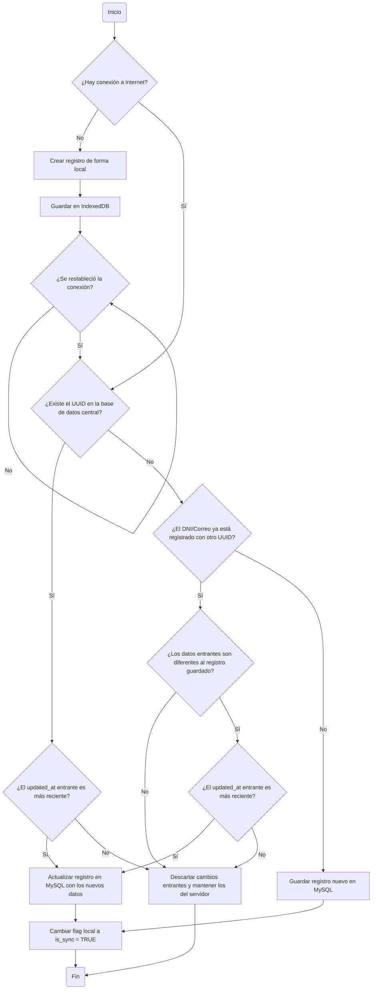

# Stack

## Frontend (Dispositivo Móvil / PWA)

- Blade Templates & TailwindCSS: Para estructurar y diseñar una interfaz limpia, adaptada a pantallas de celulares.

- Livewire: Componente encargado de la reactividad del sistema y la comunicación directa con el servidor mientras exista una conexión activa a internet.

- Alpine.js: Framework de JavaScript (integrado en Livewire) encargado de interceptar el formulario y controlar la interfaz de usuario cuando el dispositivo se quede sin señal.

- Service Workers: Scripts en segundo plano que permiten la instalación de la PWA en Android y aseguran que la aplicación visual cargue incluso sin internet.

- IndexedDB: Base de datos local e interna del navegador del celular donde Alpine.js guardará temporalmente los registros en formato JSON con el flag is_synced = false.

## Backend (Servidor en la Nube)

- Laravel Framework (PHP): Motor central encargado de recibir las peticiones de datos, procesar la lógica de negocio y ejecutar las validaciones de seguridad.

- Eloquent ORM: Herramientas de abstracción de datos de Laravel para interactuar con la base de datos de manera limpia y estructurada.

- Mecanismo de Sincronización (Ruta / API REST): Un endpoint dedicado (POST /api/sincronizar-clientes) que recibirá los lotes de datos JSON desde el celular cuando se restablezca la conexión.

- Base de Datos Central (MySQL): Motor relacional centralizado donde se consolidará de manera definitiva y permanente la información de los clientes del gimnasio.

